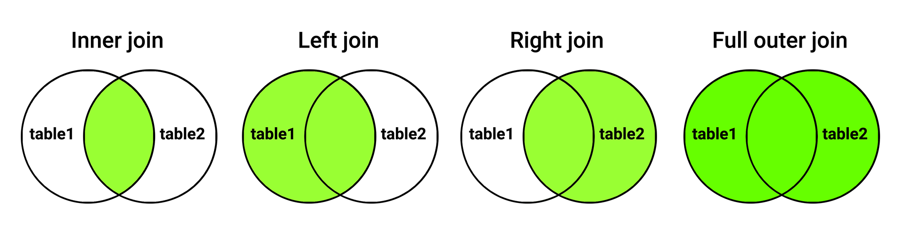

# Lesson 12

## Lesson 12.1

set up and manage a db and table

-   create table
-   seed table with data
-   perform CRUD operations (create, read, update, delete) with SQL commands

### 12.1.2 Preview

Which of the following gameplans do you think is the best way to tackle this lesson?

_We need to create the MySQL database and set up the candidates table before we can create the schema and seed files. This will allow us to determine the structure of the database and table before we create the files that will pre-populate the database with data we can use to test the application._

| Step # | Module # | Task                                      | Description                                                                                                                                                |
| ------ | -------- | ----------------------------------------- | ---------------------------------------------------------------------------------------------------------------------------------------------------------- |
| 1      | 12.1.3   | Set up the project files.                 | We'll start by creating a GitHub repository and setting up the folder structure.                                                                           |
| 2      | 12.1.4   | Create the database and candidates table. | We’ll connect to MySQL and create the first database. We’ll then add a table to the database to hold the data for the candidates.                          |
| 3      | 12.1.5   | Populate candidates table with data.      | The next step is to add data about the candidates to the table.                                                                                            |
| 3      | 12.1.6   | Save queries in schema and seed files.    | Create schema and seed files so that other developers can automatically create the database structure and pre-populate it with data from the command line. |

### 12.1.3 Set Up the Project

1. Create the Repo
1. Create the GihHub Issues
1. Clone the Repo and Create Branches
1. Set up teh Project Directory

#### Create the Repo

#### Create the GihHub Issues

**Title:**
Create a database that contains the candidates table

**Body:**
**User Story**

-   As a user, I can request a list of all potential candidates.
-   As a user, I can request a single candidate's information.
-   As a user, I want to delete a candidate.
-   As a user, I want to create a candidate.

**Title:**
Create the parties table

**Body:**
**User Story**

-   As a user, I can update a candidate's party affiliation.

-   As a user, I can request a single candidate's information, including party affiliation.

-   As a user, I can request a list of all the parties.

-   As a user, I can request a single party's information.

-   As a user, I can delete a party.

-   As a user, I can request a single candidate's information.

-   As a user, I want to delete a candidate.

-   As a user, I want to create a candidate.

**Title:**
Create the voters table

**Body:**
**User Story**

-   As a user, I can request a list of voters alphabetized by last name.
-   As a user, I can request a single voter's information.
-   As a user, I can create a voter.
-   As a user, I can update a voter's email.
-   As a user, I can delete a voter.

**Title:**
Create the votes table

**Body:**
**User Story**

-   As a user, I can tabulate all the votes cast by candidate ID in descending order.

-   As a user, I can cast a vote for a candidate.

#### Clone the Repo and Create Branches

#### Set up the Project Directory

### 12.1.4 Create the Election Database and Candidates Table

**GitHub Issue Title:**
Create a database that contains the candidates table

**User Story**

-   As a user, I can request a list of all potential candidates.
-   As a user, I can request a single candidate's information.
-   As a user, I want to delete a candidate.
-   As a user, I want to create a candidate.

| Term         | Definition                                                                                                                                                                      |
| ------------ | ------------------------------------------------------------------------------------------------------------------------------------------------------------------------------- |
| **database** | Parent container that stores interrelated tables of data. Must be created first. A collection of interrelated data, stored in one or more tables that are related to each other |
| **table**    | rows and columns. Columns = fields, row = a record                                                                                                                              |
| **query**    | request for data from a database table or a combination of tables                                                                                                               |

#### Setup a Database

| Code                        | Description                   |
| --------------------------- | ----------------------------- |
| `CREATE DATABASE election;` | creates database              |
| `USE election`              | select the database to modify |

#### Create the Candidates Table Using the MySQL CLI

```
CREATE TABLE candidates (
  id INTEGER AUTO_INCREMENT PRIMARY KEY,
  first_name VARCHAR(30) NOT NULL,
  last_name VARCHAR(30) NOT NULL,
  industry_connected BOOLEAN NOT NULL
);
```

##### Explanations

| Code                   | Explanation                                                                                                                                                                                                                    |
| ---------------------- | ------------------------------------------------------------------------------------------------------------------------------------------------------------------------------------------------------------------------------ |
| `CREATE TABLE`         | duh                                                                                                                                                                                                                            |
| `VARCHAR`              | # of characters that this column's values can have. Data storage can get expensive, important to limit it.                                                                                                                     |
| `BOOLEAN`              | `0` or `1` typically, sometimes `true` or `false` with `0` or `1` assigned                                                                                                                                                     |
| `id`                   | primarily internal to MySQL to identify records                                                                                                                                                                                |
| `PRIMARY KEY`          | `id` designated by `PRIMARY KEY` and `AUTO_INCREMENT` attributes. <br> Each value in this column must be unique for each record. <br> used to link tables together <br> each table can have only one `PRIMARY KEY` designation |
| `AUTO_INCREMENT`       | increments with each successive row and assigns that new value to the `id`.                                                                                                                                                    |
| `NOT NULL`             | column _must_ contain a value                                                                                                                                                                                                  |
| `;`                    | SQL statements require a semicolon                                                                                                                                                                                             |
| `DESCRIBE candidates;` | describes table's fields (don't forget semicolon at end)                                                                                                                                                                       |

#### Create the Candidates Table

```
CREATE TABLE candidates (
  id INTEGER AUTO_INCREMENT PRIMARY KEY,
  first_name VARCHAR(30) NOT NULL,
  last_name VARCHAR(30) NOT NULL,
  industry_connected BOOLEAN NOT NULL
);
```

use `DESCRIBE candidates` to ensure it worked.

### 12.1.5 Populate Candidates Table with Data

```
INSERT INTO candidates (first_name, last_name, industry_connected)
VALUES ('Ronald', 'Firbank', 1);
```

| Code                     | Explanation                                                          |
| ------------------------ | -------------------------------------------------------------------- |
| `INSERT INTO candidates` | load data into `candidates` table                                    |
| parentheses              | columns we'll be inserting into, comma separated                     |
| `VALUES` with CSV        | data to load into the table <br> must match the order of the columns |
| `VARCHAR` values         | must be surrounded by quotes because they're strings                 |
| `;`                      | Don't forget the semicolons                                          |

#### Query Examples

`SELECT * FROM candidates;` shows everything (`*`= wildcard) from the `candidates` table.
`SELECT first_name, last_name FROM candidates;` will only show those 2 columns

```
SELECT first_name, industry_connected
FROM candidates
WHERE industry_connected = 1;
```

"`=`" in SQL is equivalent to "`===`" in JS.

```
SELECT first_name, last_name, industry_connected
FROM candidates
WHERE id = 5;
```

### 12.1.6 Save Queries in Schema and Seed Files

_How do we share database/table setup?_

Create `db.sql` and add:

```
UPDATE candidates
SET industry_connected = 1
WHERE id = 3;
```

Create `schema.sql` and add:

```
CREATE TABLE candidates (
  id INTEGER AUTO_INCREMENT PRIMARY KEY,
  first_name VARCHAR(30) NOT NULL,
  last_name VARCHAR(30) NOT NULL,
  industry_connected BOOLEAN NOT NULL
);
```

You can't create a table or database that already exists, so need to use `DROP`: `mysql> DROP DATABASE election;`

-   To re-create, execute this in MySQL shell. `source` executes script files: `source db/db.sql`
-   add this to top of `db.sql`: `DROP DATABASE IF EXISTS election;`
-   run `source db/schema.sql` to create `candidates` table
-   use `DESCRIBE candidates;` to ensure it was created
-   create `seeds.sql` and add following:

```
INSERT INTO candidates (first_name, last_name, industry_connected)
VALUES
  ('Ronald', 'Firbank', 1),
  ('Virginia', 'Woolf', 1),
  ('Piers', 'Gaveston', 0),
  ('Charles', 'LeRoi', 1),
  ('Katherine', 'Mansfield', 1),
  ('Dora', 'Carrington', 0),
  ('Edward', 'Bellamy', 0),
  ('Montague', 'Summers', 1),
  ('Octavia', 'Butler', 1),
  ('Unica', 'Zurn', 1);
```

-   `source db/seeds.sql`
-   verify it worked with `SELECT * FROM candidates;`

#### Changing Tables

##### `UPDATE` Operation.

```
UPDATE candidates
SET industry_connected = 1
WHERE id = 3;
```

##### `DELETE` Operation

```
DELETE FROM candidates
WHERE first_name = "Montague";
```

Preferable to use id to avoid typos.

## Lesson 12.2

create API routes to allow client web application to execute CRUD operations on the db

-   Connect to a MySQL database with a Node.js application.
-   Execute SQL queries in the Express.js routes using MySQL methods.
-   Test the API endpoint using Insomnia and the browser.

### 12.2.2 Preview

| Step # | Module # | Task                                       | Description                                                                                                                                                                                                                                                                                                                                                                                                                                                                                                                                              |
| ------ | -------- | ------------------------------------------ | -------------------------------------------------------------------------------------------------------------------------------------------------------------------------------------------------------------------------------------------------------------------------------------------------------------------------------------------------------------------------------------------------------------------------------------------------------------------------------------------------------------------------------------------------------- |
| 1      | 12.2.3   | Set up the Node.js application with MySQL. | Connect to the MySQL database in the Node.js application.                                                                                                                                                                                                                                                                                                                                                                                                                                                                                                |
| 2      | 12.2.4   | Build the database calls.                  | Use mysql2 to make calls to the database to execute the SQL queries.                                                                                                                                                                                                                                                                                                                                                                                                                                                                                     |
| 3      | 12.2.5   | Create the GET routes.                     | Use Express.js to build the GET routes to perform the read operations.                                                                                                                                                                                                                                                                                                                                                                                                                                                                                   |
| 4      | 12.2.6   | Create the DELETE route.                   | Use Express.js to build the DELETE routes to perform the delete operations.                                                                                                                                                                                                                                                                                                                                                                                                                                                                              |
| 5      | 12.2.7   | Create the POST route.                     | Use Express.js to build the POST routes to perform the create operations.                                                                                                                                                                                                                                                                                                                                                                                                                                                                                |
| 6      | 12.2.8   | Save your progress with Git.               | Finally, we’ll need to close the corresponding GitHub issue.                                                                                                                                                                                                                                                                                                                                                                                                                                                                                             |
| 7      | 12.2.9   | Set up the Node.js application with MySQL. | Connect to the MySQL database in the Node.js application. Build the database calls. Use mysql2 to make calls to the database to execute the SQL queries. Create the GET routes. Use Express.js to build the GET routes to perform the read operations. Create the DELETE route. Use Express.js to build the DELETE routes to perform the delete operations. Create the POST route. Use Express.js to build the POST routes to perform the create operations. Save your progress with Git. Finally, we’ll need to close the corresponding GitHub issue. , |

We’ll need to set up the Node.js application and install the mysql2 package before we can make calls to the database and build the routes for the CRUD operations.

### 12.2.3 Set Up the Node.js Application with MySQL

1. Initialize Node.js and Create .gitignore File
1. Install npm Packages
1. Install and Set up Testing Using Jest
1. Check the Database
1. Create Connection to Express.js Server
1. Test the Express.js Connection
1. Review the server.js File
1. Connect to the MySQL Database

#### Initialize Node.js and Create .gitignore File

`npm init --y`

This will create `.gitignore and add node_modules to it, overwriting anything else pre-existing: `echo "node_modules/" > .gitignore`

#### Install npm Packages

`npm install express mysql2`
`npm install jest --save-dev`

#### Install and Set up Testing Using Jest

in `package.json`:

```
"scripts": {
  "test": "jest",
},
```

and...
`"start": "node server.js"` in `scripts` under `test`.

#### Check the Database

Important SQL Commands:

1. `mysql -u root -p` to run MySQL Server
1. `SHOW DATABASES;`
1. `USE election;`
1. `SHOW TABLES;`
1. `SELECT * FROM candidates;`

if any errors, start over with `source db/db.sql` to create the db again.

#### Create Connection to Express.js Server

```
// START IMPORT SECTION
const express = require("express");
const app = express();
// Express middleware
app.use(express.urlencoded({ extended: false }));
app.use(express.json());
// END IMPORT SECTION

const PORT = process.env.PORT || 3001;

// function to start Express.js server on port 3001. Needs to be at bottom
app.listen(port, () => {
	console.log(`Server running on port ${PORT}`);
});
```

#### Test the Express.js Connection

##### Routes

Use this to test the connection, then delete it:

```
app.get("/", (req, res) => {
	res.json({
		message: "Hello World",
	});
});
```

Start server and check it's working at localhost:3001

#### Review the server.js File

```
const express = require('express');

const PORT = process.env.PORT || 3001;
const app = express();

// Express middleware
app.use(express.urlencoded({ extended: false }));
app.use(express.json());

// Default response for any other request (Not Found)
app.use((req, res) => {
  res.status(404).end();
});

app.listen(PORT, () => {
  console.log(`Server running on port ${PORT}`);
});
```

#### Connect to the MySQL Database

```
// Connect to db
const db = mysql.createConnection(
	{
		host: "localhost",
		// My MySQL username,
		user: "root",
		// My password:
		password: "REDACTED",
		database: "election",
	},
	console.log("connected to the election database")
);
```

### 12.2.4 Build the Database Calls

add to `server.js`above `catchall` route totest connectionto db

```
db.query(`SELECT * FROM candidates`, (err, rows) => {
  console.log(rows);
});
```

-   `db` object using SQL's `query()` method
-   Once this method executes the SQL command, callback function capturs responses from qeury in two variables
    -   `err` for error response. If no errors, the `err` value is `null`.
    -   `rows` is the db query response.

#### Create MySQL Queries for Read, Delete, and Create Operations

##### Create Query for Read Operation

return a single candidate from the `candidates` table based on their `id.`

```
// GET a single candidate
db.query(`SELECT * FROM candidates WHERE id = 1`, (err, row) => {
  if (err) {
    console.log(err);
  }
  console.log(row);
});
```

-   `id` `1` is hardcoded for now.
-   if there aren't any errors, `err` comes back as `null`.

##### Create Query for Delete Operation

```
// Delete a candidate
db.query(`DELETE FROM candidates WHERE id = ?`, 1, (err, result) => {
  if (err) {
    console.log(err);
  }
  console.log(result);
});
```

-   question mark denotes a placeholder for a **prepared statement**. It can execute the same SQL statements repeatedly using different values in place of the placeholder.
-   additional `param` argument following prepared statemetn provieds values to use in place of prepared statement's placeholders. `1` hardcoded temporarily.
-   If you need additional placeholders, the `param` argument can be an array that holds multiple values for multiple placeholders.

##### Create Query for Create Operation

```
// Create a candidate
const sql = `INSERT INTO candidates (id, first_name, last_name, industry_connected)
              VALUES (?,?,?,?)`;
const params = [1, 'Ronald', 'Firbank', 1];

db.query(sql, params, (err, result) => {
  if (err) {
    console.log(err);
  }
  console.log(result);
});
```

-   because `sql` statement and `params` long, we assigned them variables
-   `INSERT INTO` adds values assigned to `params`.
-   we need four placeholders (`?`) for the four values. Values in the `params` array must match the order of those placeholders.

### 12.2.5 Create the GET Routes

wrap the "GET Candidates" code in an Express.js route:

```
// Get all candidates
app.get('/api/candidates', (req, res) => {
  const sql = `SELECT * FROM candidates`;

  db.query(sql, (err, rows) => {
    if (err) {
      res.status(500).json({ error: err.message });
      return;
    }
    res.json({
      message: 'success',
      data: rows
    });
  });
});
```

-   `api` in the URL signifies it's an API endpoint
-   The callback function will handle the client's request and the database's response
-   status code of 500 = server error (404 = user request error)
-   see result at http://localhost:3001/api/candidate

#### Get a Single Candidate

```
// Get a single candidate
app.get('/api/candidate/:id', (req, res) => {
  const sql = `SELECT * FROM candidates WHERE id = ?`;
  const params = [req.params.id];

  db.query(sql, params, (err, row) => {
    if (err) {
      res.status(400).json({ error: err.message });
      return;
    }
    res.json({
      message: 'success',
      data: row
    });
  });
});
```

-   `get()` route method again
-   endpoint has route parameter that will hold teh value of `id` to specify which candidate we'll select from the database.
-   In database call, we assign captured value populated in the `req.params` object with the key `id` to `params`.
-   The db call will then query `candidates` table with this `id` & retrieve teh row specified
-   Because `params` can be accepted into db call as an array, `params` is assigned as an array with a single element (`req.params.id`)
-   Error status code 400 to notify client their request wasn't accepted and to try a different one.
-   In the route response, `row` sent back to client in a JSON object.
-   front-end team can use this API endpoint to select a specific candidate from the database. Each name links to an endpoint that can return details corresponding to the name selected.

### 12.2.6 Create the DELETE Route

```
// Delete a candidate
app.delete('/api/candidate/:id', (req, res) => {
  const sql = `DELETE FROM candidates WHERE id = ?`;
  const params = [req.params.id];

  db.query(sql, params, (err, result) => {
    if (err) {
      res.statusMessage(400).json({ error: res.message });
    } else if (!result.affectedRows) {
      res.json({
        message: 'Candidate not found'
      });
    } else {
      res.json({
        message: 'deleted',
        changes: result.affectedRows,
        id: req.params.id
      });
    }
  });
});
```

-   uses HTTP request method `delete()`
-   prepared SQL statement as placeholder variable `sql`
-   `req.params.id` assigned to `params`
-   Using route paramater again to uniquely identify the candidate to remove.
-   Need to use insomnia to test it.
-   front-end team could use this to remove people from `candidates` if/when someone drops out.

### 12.2.7 Create the POST Route

_create API endpoint that will create candidadates_
add Ronald back to the race

```
// Create a candidate
app.post('/api/candidate', ({ body }, res) => {
  const errors = inputCheck(body, 'first_name', 'last_name', 'industry_connected');
  if (errors) {
    res.status(400).json({ error: errors });
    return;
  }
});
```

-   using HTTP request method `post()` to insert a candidate into `candidates`table.
-   using API endpoint `/api/candidate`
-   in callback, using `req.body` to populate candidate's data
    -   using object destructuring to pull `body` property out of the request object.
    -   Previously, we passed entire reqeust object to the routes in the `req` parameter.
-   `inputCheck` module created by team member to verify user info can create a candidate.
    -   If it returns an error, an error message returned as 400 code
    -   Need to import this module `const inputCheck = require('./utils/inputCheck');`

Add db call inside the post routine

```
const sql = `INSERT INTO candidates (first_name, last_name, industry_connected)
  VALUES (?,?,?)`;
const params = [body.first_name, body.last_name, body.industry_connected];

db.query(sql, params, (err, result) => {
  if (err) {
    res.status(400).json({ error: err.message });
    return;
  }
  res.json({
    message: 'success',
    data: body
  });
});
```

-   SQL statement doesn't need a column for `id`. It's autogenerated.
-   `params` assignment contains 3 elements in its array that contains the user data collected in `req.body`.

### 12.2.8 Save Progress with Git

Save your work, then add, commit, and push to GitHub.

```
git add .
git commit -m "add CRUD routes"
git push origin feature/candidates
```

Now let's checkout into the develop branch and merge the feature branch:

```
git checkout develop
git merge feature/candidates
```

Push that branch to GitHub:

```
git push origin develop
```

Next, checkout into main and merge develop.

```
git checkout main
git merge develop
```

#### Quiz

What's wrong with the following code?

```
app.delete('/api/candidate/:id', (req, res) => {
  const sql = `DELETE FROM candidates WHERE id = ?`;

  db.query(sql, req.params.id, (err, result) => {
    if (err) {
      res.status(400).json({ error: res.message });
    }
    res.json({
      message: 'deleted',
      changes: result.affectedRows,
      id: req.params.id
    });
  });
});
```

???
There's nothing preventing the deletion of a candidate that doesn't exist.
_Yes, it's missing an else if statement that will ensure that there are no affectedRows as a result of the query._

It's missing the params variable that would allow the prepared statement to work correctly.
_No, this will still work because we have req.params.id as the param argument which provides the id for the prepared statement ? placeholder._

The status code should be 500
_No, the status code should be 400 because we need to notify the client that their request wasn't accepted, not that there was a server error._

## 12.3

### 12.3.1 Create the Parties Table

Tasks:

-   Creating a new table using MySQL.
-   Populating the new table with data.
-   Creating API routes to retrieve this data via HTTP requests.

Be able to:

-   Update a schema to accommodate new fields.
-   Combine data from two separate tables.
-   Implement constraints to avoid bad data from persisting.

### 12.3.2 Preview

_The candidate routes won’t be able to join with the party data and return this combined data until the candidates table includes a party reference._

| Step # | Module # | Task                                              | Description                                                                                         |
| ------ | -------- | ------------------------------------------------- | --------------------------------------------------------------------------------------------------- |
| 1      | 12.3.3   | Create and populate a parties table.              | You'll need some party data before you can make progress on any other step.                         |
| 2      | 12.3.4   | Update the candidates table to reference parties. | Once you have a parties table, you can update the candidates table to reference it.                 |
| 3      | 12.3.5   | Create API routes for parties.                    | The routes for parties are fairly straightforward, so it would be helpful to take care of them now. |
| 4      | 12.3.6   | Add a candidate route to change their party.      | Finally, you can tackle the trickier route of updating an existing record.                          |

### 12.3.3 Create and Populate a Parties Table

#### Relational Data

-   prevents duplicate data y storing info in one location only
-   makes it easier to retrieve specific isolated data
-   reduces clutter in the db forcing a table to only contain the most pertinent data

add to `schema.sql` at top:

```
CREATE TABLE parties (
  id INTEGER AUTO_INCREMENT PRIMARY KEY,
  name VARCHAR(500) NOT NULL,
  description TEXT
);
```

-   `TEXT` data type for `description` and _not_ `VARCHAR` because it can store much longer strings of varying length.
    -   Use sparingly to avoid file-size bloat.

### 12.3.4 Update the Candidates Table to Reference Parties

**foreign key**: a field in one table that references theprimary key of another table.

`ALTER TABLE`: add a new field to a pre-existing table without losing data
enter in MySQL Shell:

```
ALTER TABLE candidates ADD COLUMN party_id INTEGER;
```

(`NOT NULL` omitted because some may not belong to a party)

add to `schema.sql` code:

```
CREATE TABLE candidates (
  id INTEGER AUTO_INCREMENT PRIMARY KEY,
  first_name VARCHAR(30) NOT NULL,
  last_name VARCHAR(30) NOT NULL,
  party_id INTEGER,
  industry_connected BOOLEAN NOT NULL,
  CONSTRAINT fk_party FOREIGN KEY (party_id) REFERENCES parties(id) ON DELETE SET NULL
);
```

**constraint**:

-   allows you to flag a field as an official foreign key
-   tells SQL which table and field it references
-   noid can be inserted into `candidates` table if it doesn't also exist in the `parties` table
-   therefore, `parties` table must be defined first
-   `ON DELETE SET NULL` will set a candidate's `party_id` to `NULL` if the corresponding row in `parties` is ever deleted

The parties need to be created first or the `INSERT` statements will fail due to the foreign key constraint added to the `candidates` schema.d
add into `seeds.sql`:

```
INSERT INTO parties (name, description)
VALUES
  ('JS Juggernauts', 'The JS Juggernauts eat, breathe, and sleep JavaScript. They can build everything you could ever want in JS, including a new kitchen sink.'),
  ('Heroes of HTML', 'Want to see a mock-up turn into an actual webpage in a matter of minutes? Well, the Heroes of HTML can get it done in a matter of seconds.'),
  ('Git Gurus', 'Need to resolve a merge conflict? The Git Gurus have your back. Nobody knows Git like these folks do.');

INSERT INTO candidates (first_name, last_name, party_id, industry_connected)
VALUES
  ('Ronald', 'Firbank', 1, 1),
  ('Virginia', 'Woolf', 1, 1),
  ('Piers', 'Gaveston', 1, 0),
  ('Charles', 'LeRoi', 2, 1),
  ('Katherine', 'Mansfield', 2, 1),
  ('Dora', 'Carrington', 3, 0),
  ('Edward', 'Bellamy', 3, 0),
  ('Montague', 'Summers', 3, 1),
  ('Octavia', 'Butler', 3, 1),
  ('Unica', 'Zurn', NULL, 1);
```

test deleting of party:

```
DELETE FROM parties WHERE id = 1;
SELECT * FROM candidates;
```

### 12.3.5 Update Candidate Routes to Join With Party Data

**one-to-many** relationship: using foreign keys to reference data in other tables

#### SQL's `JOIN` Statements

The voting app's goal is to display a candidate's info alongside his/her party's name, not the `id`. We _don't_ have to query db twice (candidate & party, then merge. NOPE)


in MySQL shell:

```
SELECT * FROM candidates
LEFT JOIN parties ON candidates.party_id = parties.id;
```

-   dot notation to specify `party_id` column in `candidates` table, just like js with object.property

Reviewing progress so far before attempting the `JOIN`...
_may help to zoom out to see table without breaks_

##### Parties Table

```
mysql> select * from parties;
+----+----------------+--------------------------------------------------------------------------------------------------------------------------------------------+
| id | name           | description                                                                                                                                |
+----+----------------+--------------------------------------------------------------------------------------------------------------------------------------------+
|  1 | JS Juggernauts | The JS Juggernauts eat, breathe, and sleep JavaScript. They can build everything you could ever want in JS, including a new kitchen sink.  |
|  2 | Heroes of HTML | Want to see a mock-up turn into an actual webpage in a matter of minutes? Well, the Heroes of HTML can get it done in a matter of seconds. |
|  3 | Git Gurus      | Need to resolve a merge conflict? The Git Gurus have your back. Nobody knows Git like these folks do.                                      |
+----+----------------+--------------------------------------------------------------------------------------------------------------------------------------------+
3 rows in set (0.00 sec)
```

##### Candidates Table

```
mysql> select * from candidates;
+----+------------+------------+----------+--------------------+
| id | first_name | last_name  | party_id | industry_connected |
+----+------------+------------+----------+--------------------+
|  1 | Ronald     | Firbank    |        1 |                  1 |
|  2 | Virginia   | Woolf      |        1 |                  1 |
|  3 | Piers      | Gaveston   |        1 |                  0 |
|  4 | Charles    | LeRoi      |        2 |                  1 |
|  5 | Katherine  | Mansfield  |        2 |                  1 |
|  6 | Dora       | Carrington |        3 |                  0 |
|  7 | Edward     | Bellamy    |        3 |                  0 |
|  8 | Montague   | Summers    |        3 |                  1 |
|  9 | Octavia    | Butler     |        3 |                  1 |
| 10 | Unica      | Zurn       |     NULL |                  1 |
+----+------------+------------+----------+--------------------+
10 rows in set (0.00 sec)
```

This query...

```
SELECT * FROM candidates
LEFT JOIN parties ON candidates.party_id = parties.id;
```

returns...

```
mysql> SELECT * FROM candidates
    -> LEFT JOIN parties ON candidates.party_id = parties.id;
+----+------------+------------+----------+--------------------+------+----------------+--------------------------------------------------------------------------------------------------------------------------------------------+
| id | first_name | last_name  | party_id | industry_connected | id   | name           | description                                                                                                                                |
+----+------------+------------+----------+--------------------+------+----------------+--------------------------------------------------------------------------------------------------------------------------------------------+
|  1 | Ronald     | Firbank    |        1 |                  1 |    1 | JS Juggernauts | The JS Juggernauts eat, breathe, and sleep JavaScript. They can build everything you could ever want in JS, including a new kitchen sink.  |
|  2 | Virginia   | Woolf      |        1 |                  1 |    1 | JS Juggernauts | The JS Juggernauts eat, breathe, and sleep JavaScript. They can build everything you could ever want in JS, including a new kitchen sink.  |
|  3 | Piers      | Gaveston   |        1 |                  0 |    1 | JS Juggernauts | The JS Juggernauts eat, breathe, and sleep JavaScript. They can build everything you could ever want in JS, including a new kitchen sink.  |
|  4 | Charles    | LeRoi      |        2 |                  1 |    2 | Heroes of HTML | Want to see a mock-up turn into an actual webpage in a matter of minutes? Well, the Heroes of HTML can get it done in a matter of seconds. |
|  5 | Katherine  | Mansfield  |        2 |                  1 |    2 | Heroes of HTML | Want to see a mock-up turn into an actual webpage in a matter of minutes? Well, the Heroes of HTML can get it done in a matter of seconds. |
|  6 | Dora       | Carrington |        3 |                  0 |    3 | Git Gurus      | Need to resolve a merge conflict? The Git Gurus have your back. Nobody knows Git like these folks do.                                      |
|  7 | Edward     | Bellamy    |        3 |                  0 |    3 | Git Gurus      | Need to resolve a merge conflict? The Git Gurus have your back. Nobody knows Git like these folks do.                                      |
|  8 | Montague   | Summers    |        3 |                  1 |    3 | Git Gurus      | Need to resolve a merge conflict? The Git Gurus have your back. Nobody knows Git like these folks do.                                      |
|  9 | Octavia    | Butler     |        3 |                  1 |    3 | Git Gurus      | Need to resolve a merge conflict? The Git Gurus have your back. Nobody knows Git like these folks do.                                      |
| 10 | Unica      | Zurn       |     NULL |                  1 | NULL | NULL           | NULL                                                                                                                                       |
+----+------------+------------+----------+--------------------+------+----------------+--------------------------------------------------------------------------------------------------------------------------------------------+
10 rows in set (0.00 sec)
```

...this is too much info. Using `candidates.*` is equilavent to selecting all the columns in `candidates`

```
SELECT candidates.*, parties.name
FROM candidates
LEFT JOIN parties ON candidates.party_id = parties.id;
```

```
mysql> SELECT candidates.*, parties.name
    -> FROM candidates
    -> LEFT JOIN parties ON candidates.party_id = parties.id;
+----+------------+------------+----------+--------------------+----------------+
| id | first_name | last_name  | party_id | industry_connected | name           |
+----+------------+------------+----------+--------------------+----------------+
|  1 | Ronald     | Firbank    |        1 |                  1 | JS Juggernauts |
|  2 | Virginia   | Woolf      |        1 |                  1 | JS Juggernauts |
|  3 | Piers      | Gaveston   |        1 |                  0 | JS Juggernauts |
|  4 | Charles    | LeRoi      |        2 |                  1 | Heroes of HTML |
|  5 | Katherine  | Mansfield  |        2 |                  1 | Heroes of HTML |
|  6 | Dora       | Carrington |        3 |                  0 | Git Gurus      |
|  7 | Edward     | Bellamy    |        3 |                  0 | Git Gurus      |
|  8 | Montague   | Summers    |        3 |                  1 | Git Gurus      |
|  9 | Octavia    | Butler     |        3 |                  1 | Git Gurus      |
| 10 | Unica      | Zurn       |     NULL |                  1 | NULL           |
+----+------------+------------+----------+--------------------+----------------+
10 rows in set (0.00 sec)
```
Using `AS` lets you define an **alias** for data:
```
SELECT candidates.*, parties.name AS party_name
FROM candidates
LEFT JOIN parties ON candidates.party_id = parties.id;
```

```
mysql> SELECT candidates.*, parties.name AS party_name
    -> FROM candidates
    -> LEFT JOIN parties ON candidates.party_id = parties.id;
+----+------------+------------+----------+--------------------+----------------+
| id | first_name | last_name  | party_id | industry_connected | party_name     |
+----+------------+------------+----------+--------------------+----------------+
|  1 | Ronald     | Firbank    |        1 |                  1 | JS Juggernauts |
|  2 | Virginia   | Woolf      |        1 |                  1 | JS Juggernauts |
|  3 | Piers      | Gaveston   |        1 |                  0 | JS Juggernauts |
|  4 | Charles    | LeRoi      |        2 |                  1 | Heroes of HTML |
|  5 | Katherine  | Mansfield  |        2 |                  1 | Heroes of HTML |
|  6 | Dora       | Carrington |        3 |                  0 | Git Gurus      |
|  7 | Edward     | Bellamy    |        3 |                  0 | Git Gurus      |
|  8 | Montague   | Summers    |        3 |                  1 | Git Gurus      |
|  9 | Octavia    | Butler     |        3 |                  1 | Git Gurus      |
| 10 | Unica      | Zurn       |     NULL |                  1 | NULL           |
+----+------------+------------+----------+--------------------+----------------+
10 rows in set (0.00 sec)
```
